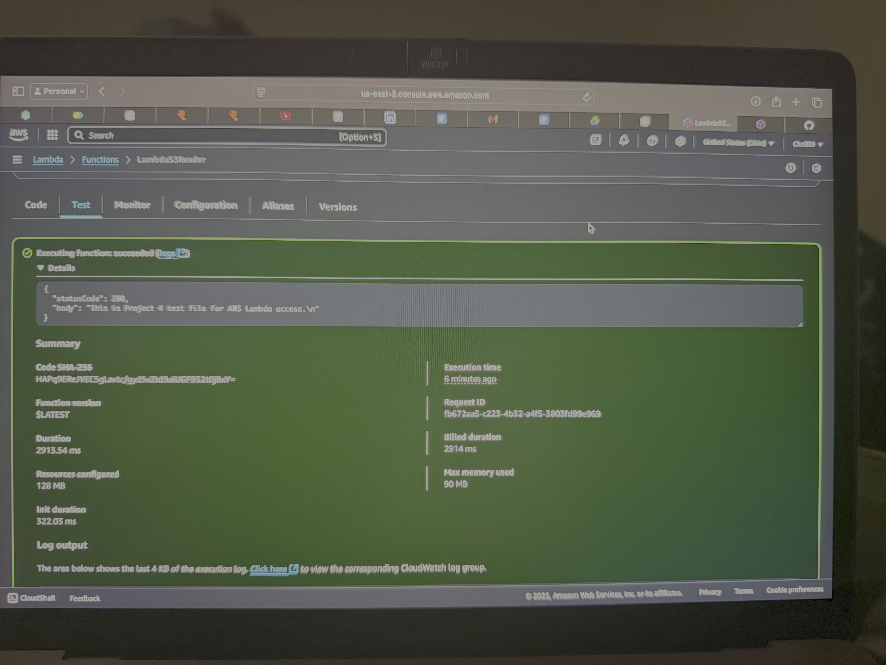

# AWS Lambda S3 Reader

A beginner AWS IAM & Lambda project that demonstrates how to securely access files in an S3 bucket using a Lambda function.

---

## 📌 Project Overview
This project shows how to:
1. Create an **IAM Role** with `AmazonS3ReadOnlyAccess`.
2. Create an **S3 Bucket** and upload a test file (`lambda-test.txt`).
3. Create an **AWS Lambda Function** with Python 3.9 runtime to read the file.
4. Attach the IAM Role to the Lambda function.
5. Trigger a **test event** to verify Lambda can access the file.

---

## 📂 Project Structure
AWS-Lambda-S3Reader/
│
├── README.md <- Project Documentation
├── lambda-test.txt <- Test file stored in S3
├── code/
│ └── lambda_function.py <- Python Lambda Function Code
└── Screenshots/
├── Lambda_output01.jpg <- Lambda execution result
├── Lambda_output02.jpg <- Lambda console logs
└── Lambda_test_success.png<- Successful execution proof

---

## ✅ Skills Demonstrated
- AWS Lambda (Python)
- AWS S3 Access with IAM Roles
- Serverless Security Principles
- GitHub Project Documentation

---

## 📸 Screenshots

---

**Author:** Divine Maxwell  
*Cloud Security / IAM Enthusiast*
